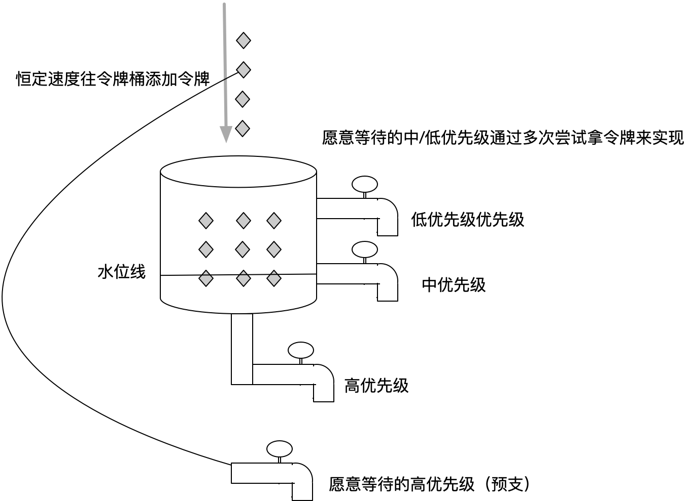
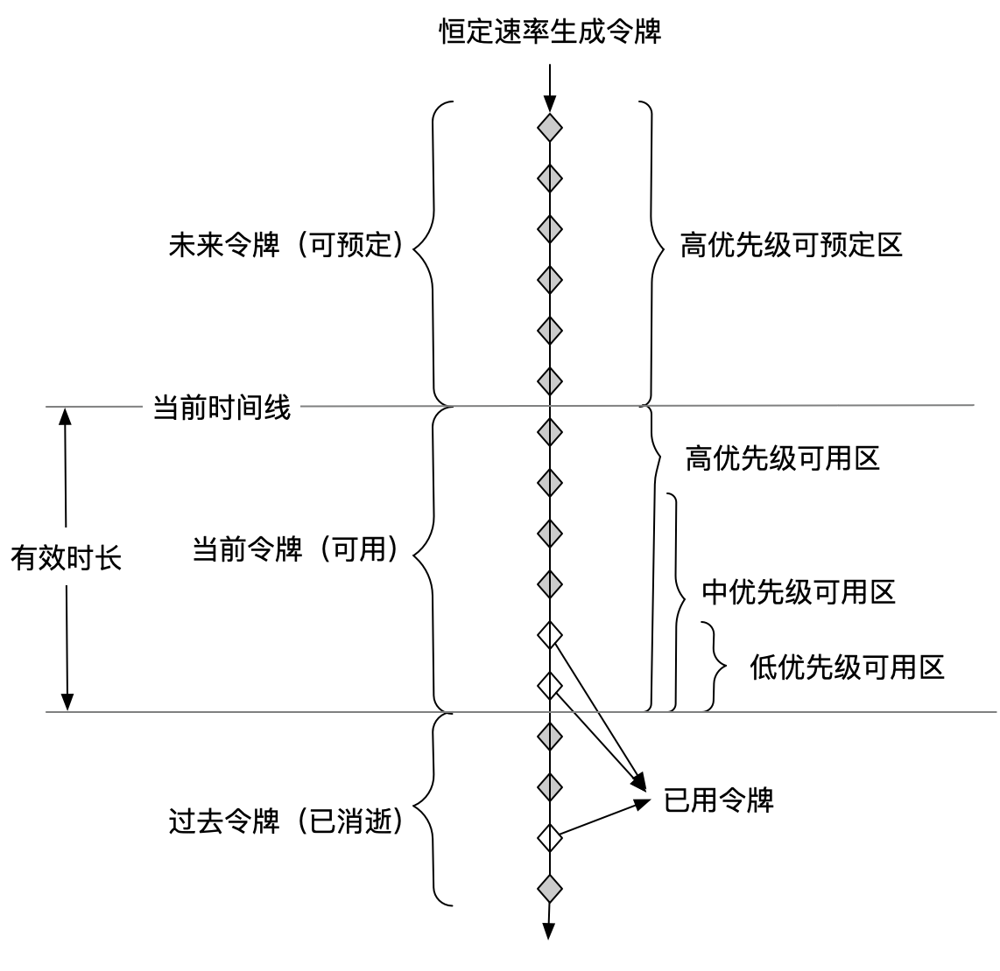
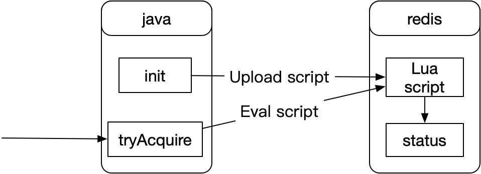

## 算法逻辑设计

本方案采用改良的令牌桶算法。令牌桶算法控制的是qps，可以和其它控制并发数的限流器组合使用

1. 基本的令牌桶算法能力控制最大处理能力（可理解成qps）
2. 改良部分为优先级控制。用参数reservedPercent（令牌桶预留百分比）控制。
   * 例如一次请求时要求令牌桶预留百分比 50%， 而桶最大令牌数100 个，那么在令牌桶剩余令牌只有 50 个时会获取不到令牌，所以 reservedPercent 越小优先级越高。这个参数取值[0,100]
   * 如果reservedPercent=100,请求必然被限制
   * reservedPercent=0时可以用掉全部的令牌
3. 令牌桶有个参数maxWaitTime可以用来削峰填谷，我们对这个参数做了扩展
   * 在reservedPercent=0时，为标准的令牌桶算法
   * 在0<reservedPercent<=100时，如果第一次没拿到令牌，会将maxWaitTime切分成3段，再尝试获取令牌3次
   * maxWaitTime=0是，只会拿一次令牌，没拿到的情况下马上被限制

### 用桶图释不同优先级的情况

关键点阐述

1. 恒定的速度往桶里面添加令牌
2. 优先级不同理解为在不同水位线开水龙头
   * 当最下面的水龙头开的很大超过添加速度时，上面的龙头很快就不会有水流出
   * 当最下面的水龙头关闭时，上面的水龙头流水速度可以达到令牌添加速度

### 用时间流逝解释不同优先级情况

这里用另外一种方式来解释原来，和上图说的是同一个事情。

本解释更符合算法的实现逻辑，上图的解释更贴近现实生活，可以相结合来看

关键点阐述：

1. 有效时长决定桶的大小。桶的大小决定可接受的最大瞬时峰值
2. 低优先级可以看到的区域较小，但是全部令牌都会从其区域通过，依然有机会用到全部令牌
3. 高优先级因为可以先看到令牌，所以可以优先拿取令牌。（时间决定成败）
4. 可预定还没有生成的令牌，但是真正拿到的时间是在被预定的令牌到达时

### 物理视图

物理架构阐述

1. 类在初始化时将lua脚本从本地上传到redis服务器
   * 上传时带了key，并用key在redis中做初始化。在分布式redis情况下，会根据key路由到其中一台机器，后续调用脚本时，key需要一样
2. 尝试获取令牌时会调用已经存储在redis上的lua脚本，传入key、时间等参数，算法核心逻辑在lua脚本中

## QA

1. 能否应对瞬间并发？

  可以应对瞬间并发。可以通过参数maxPermits 和 maxWaitTime控制这瞬间流量多少通过、多少延后、多少被丢弃。 灵活性很强，根据业务情况调整到最优值

2. 并发量特别大的情况能否处理？

  redis的性能非常高，可以处理相当高的并发。如果流量特别到的情况，可以进行hash分片等方式来分散到多个key
  
## 参考资料和文档

1. [lattebank/rate-limiter](https://github.com/lattebank/rate-limiter)
2. [基于redis和lua的分布式限流器设计与实现](https://www.jianshu.com/p/c8cee1507ccc)
3. [限流原理解读之guava中的RateLimiter](https://juejin.im/post/5bb48d7b5188255c865e31bc)
4. [聊聊高并发系统之限流特技](https://jinnianshilongnian.iteye.com/blog/2305117)
5. [令牌桶算法限流](https://blog.csdn.net/SunnyYoona/article/details/51228456)
6. [如何设计API的限流(Rate Limit)功能：4种类型限流器图解](https://www.codercto.com/a/2539.html)

